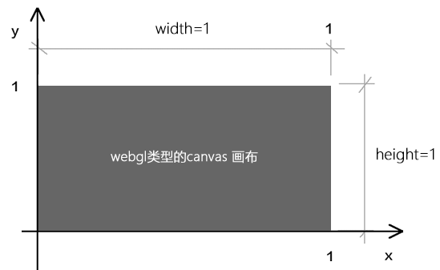
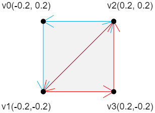
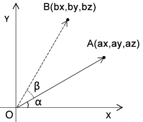
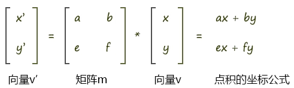

# webgl 入门

### 可视化

-   html + css(3) + js(requestAnimationFrame)
-   canvas(D3、Echarts、Leaflet、Fabric)
-   webgl(three)

### 简介

很久前，在浏览器中实现 3D 效果需要浏览器插件例如`flash`，webgl 的出现使得浏览器中使用 js 可以完成 3D 绘制，但是不是 js 实现 3D，而是一种跨平台的规范，它是运行在 gpu 上的一种编程语言（GLSL）。

> CPU(js) -->-- 数据 -->-- GPU(着色器程序) -->-- 画布中展示(3D 模型 -> 2D 屏幕)

### GLSL 是什么

前面说了是一种新语言，运行在 gpu，拿着 cpu 上 js 给的数据做内容渲染 <br>
所以学习 webgl 的本质就是学会 GLSL 语法 & js 如何丢给他数据


### 基本概念

-   顶点着色器 和 片元着色器
-   gl_Position： 内置变量，用来设置顶点坐标。
-   gl_PointSize： 内置变量，用来设置顶点大小。
-   gl_FragColor： 内置变量，用来设置像素颜色。
-   gl_FragCoord： 内置变量，片元坐标，单位像素
-   precision：精度设置限定符，使用此限定符设置完精度后，之后所有该数据类型都将沿用该精度，除非单独设置。
-   vec2：2 维向量。
-   vec4：4 维向量。

-   vec _ 浮点数： vec2(x, y) _ 2.0 = vec(x _ 2.0, y _ 2.0)。
-   vec2 _ vec2：vec2(x1, y1) _ vec2(x2, y2) = vec2(x1 _ x2, y1 _ y2)。

-   attribute：在顶点着色器中声明跟顶点相关的数据。
-   uniform：在着色器中声明非顶点数据(如光源位置数据、方向数据、矩阵数据)。
-   distance：计算顶点之间距离。
-   discard:舍弃片元。
-   drawArrays 类型

```
POINTS 可视的点
LINES 单独线段
LINE_STRIP 线条
LINE_LOOP 闭合线条
TRIANGLES 单独三角形
TRIANGLE_STRIP 三角带
TRIANGLE_FAN 三角扇
```

### example 大纲

-   画一个点 01.point.html

```
1. `glsl` 中定义点坐标 + size
2. js 中初始化 webgl
3. drawArrays => gl.POINTS 点类型
```


canvas 坐标系

webgl 坐标系

-   画多个点（动态画点）

```js
1. 明确需要暴露给 js 的变量，例如 点坐标、点颜色
2. canvas 和 glsl 坐标轴的转化
3. 在js中取变量 & 赋值
const a_Position = gl.getAttribLocation(gl.program, 'a_Position');
gl.vertexAttrib2f(a_Position, x, y);
4. drawArrays
```

-   面（三角面）

```js
1. 在点的基础上，定义缓冲区，用来处理一次多个点
// 缓冲对象
const vertexBuffer = gl.createBuffer();
// 绑定缓冲对象
gl.bindBuffer(gl.ARRAY_BUFFER, vertexBuffer);
// 写入数据
gl.bufferData(gl.ARRAY_BUFFER, vertices, gl.STATIC_DRAW);
2. 三角为三个点，确定三点坐标
const vertices = new Float32Array([0, 0.1, -0.1, -0.1, 0.1, -0.1]);
3. 绘制顶点
gl.drawArrays(gl.TRIANGLES, 0, 3);
```

-   矩形（三角面拼接）

```js
1. 用 TRIANGLE_STRIP 三角带拼矩形
2. 在绘制三角形基础上，坐标传 4 个点，顺序如下
const vertices = new Float32Array([-0.2, 0.2, -0.2, -0.2, 0.2, 0.2, 0.2, -0.2]);
```



-   平移、缩放、旋转

```js

1. case1: 平移，利用向量相加，重新确定新的点坐标
gl_Position = a_Position + u_Translation;
2. case2: 缩放
gl_Position = vec4(vec3(a_Position) * u_Scale, 1.0);

const u_Scale = gl.getUniformLocation(gl.program, 'u_Scale');
const scale = Math.sin(angle) + 1;
gl.uniform1f(u_Scale, scale);

3. case3: 旋转 ⬇️矩阵
```

-   矩阵 Matrix




```js
1. 原理: 和角公式
cosθ=cos(α+β)
cosθ=cosα*cosβ-sinα*sinβ
sinθ=sin(α+β)
sinθ=cosβ*sinα+sinβ*cosα

2. 定义matrix
const u_Matrix = gl.getUniformLocation(gl.program, 'u_Matrix');
let angle = 0.5;
const sinB = Math.sin(angle);
const cosB = Math.cos(angle);
const matrix = [cosB, sinB, -sinB, cosB];
gl.uniformMatrix2fv(u_Matrix, false, matrix);

3. 使用 threejs 的 Matrix4 方法，好实现
```

-   立方体（改变视角）

```js
1. 定义 8 个顶点、12 个线的索引
2. 利用向量相乘，改变坐标位置
gl_Position = u_ViewMatrix * a_Position;
3. lookAt

```

```js
1. 如何旋转起来，利用矩阵模型
gl_Position = u_ViewMatrix * u_ModelMatrix * a_Position;

2. 改变旋转角度
new Matrix4().makeRotationY(angle);
```

### 参考

-   https://juejin.cn/post/6973318096454975525
-   https://github.com/lucefer/webgl
